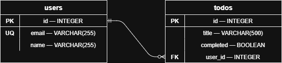

# ToDo Service

Минимальный ToDo API на **archtool v2.x** + **web_fractal** + **FastAPI** + **SQLAlchemy (async)**.



## Быстрый старт

```bash
# 1. Создать и активировать виртуальное окружение
python3 -m venv venv
source venv/bin/activate        # Windows: venv\Scripts\activate

# 2. Установить зависимости
pip install -r requirements.txt

# 3. Запустить (из папки todo_app/)
python entrypoints/run.py
# или:
uvicorn entrypoints.run:app --host 0.0.0.0 --port 8000
```

БД SQLite (`todo.db`) и все таблицы создаются автоматически при запуске.

Swagger UI: http://localhost:8000/docs

## Структура проекта

```
todo_app/
├── entrypoints/
│   └── run.py                       ← точка входа FastAPI + uvicorn
├── app/
│   ├── config.py                    ← DATABASE_URL, HOST, PORT
│   ├── archtool_conf/
│   │   ├── custom_layers.py         ← список APPS + app_layers (4 дефолтных слоя)
│   │   └── bundle_project.py        ← bundle() — сборка DI + FastAPI
│   ├── users/
│   │   ├── interfaces.py            ← UserRepoABC, UserServiceABC, UserControllerABC
│   │   ├── models.py                ← UserORM (SQLAlchemy)
│   │   ├── repos.py                 ← UserRepo
│   │   ├── services.py              ← UserService
│   │   ├── controllers.py           ← UserController (FastAPI router)
│   │   ├── dtos.py / dms.py
│   │   └── exceptions.py
│   └── todos/
│       ├── interfaces.py            ← TodoRepoABC, TodoServiceABC, TodoControllerABC
│       ├── models.py                ← TodoORM
│       ├── repos.py                 ← TodoRepo
│       ├── services.py              ← TodoService (зависит от UserServiceABC — кросс-модуль!)
│       ├── controllers.py           ← TodoController
│       ├── dtos.py / dms.py
│       └── exceptions.py
└── requirements.txt
```

## Эндпоинты

| Метод  | URL                               | Описание                          |
|--------|-----------------------------------|-----------------------------------|
| POST   | `/users/create_user`              | Создать пользователя `{email, name}` |
| GET    | `/users/{user_id}`                | Получить пользователя по ID       |
| POST   | `/todos/create_todo`              | Создать задачу `{title, user_id}` |
| GET    | `/todos/list_todos?user_id=…`     | Список задач пользователя         |
| PATCH  | `/todos/{todo_id}/complete_todo`  | Отметить задачу как выполненную   |

## Примеры curl

```bash
curl -X POST http://localhost:8000/users/create_user \
  -H 'Content-Type: application/json' \
  -d '{"email": "alice@example.com", "name": "Alice"}'

curl http://localhost:8000/users/1

curl -X POST http://localhost:8000/todos/create_todo \
  -H 'Content-Type: application/json' \
  -d '{"title": "Купить молоко", "user_id": 1}'

curl "http://localhost:8000/todos/list_todos?user_id=1"

curl -X PATCH http://localhost:8000/todos/1/complete_todo
```

## Примечание о совместимости

`web_fractal.building_utils.initialize_controllers_api` внутри обращается к устаревшему
атрибуту `injector._dependencies` (имя из archtool v0.x). В функции `bundle()` эта логика
реализована напрямую через публичный `injector.dependencies` (archtool v2.x).